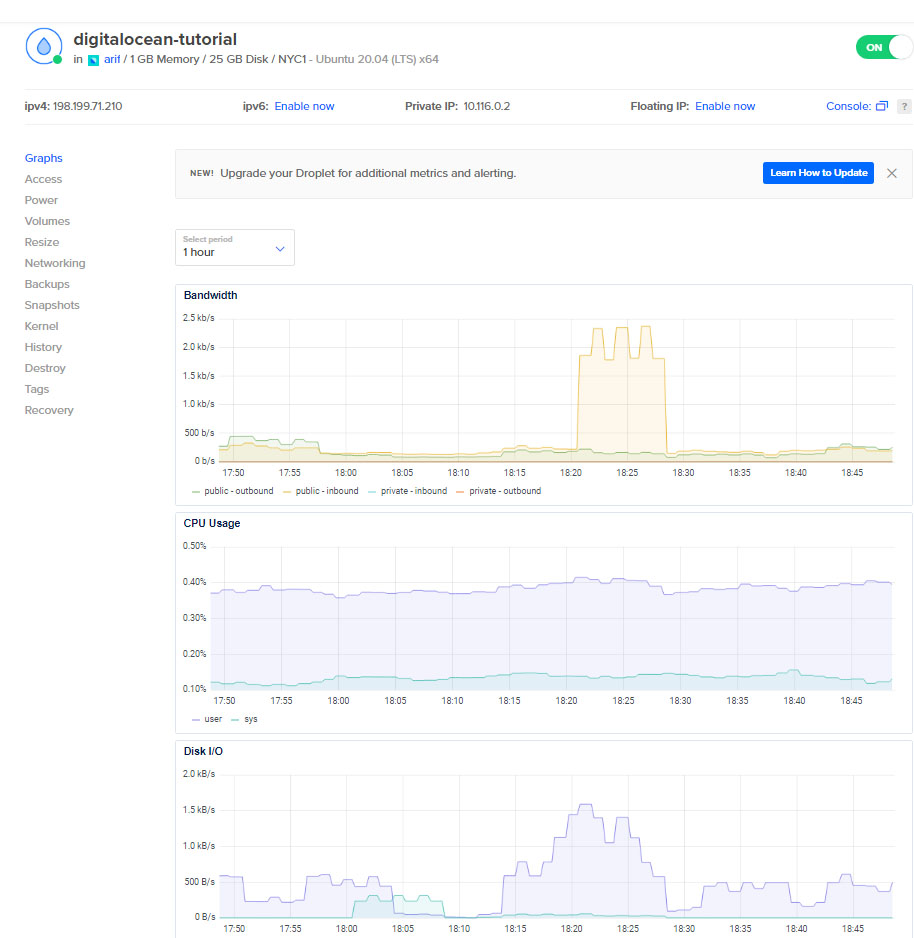
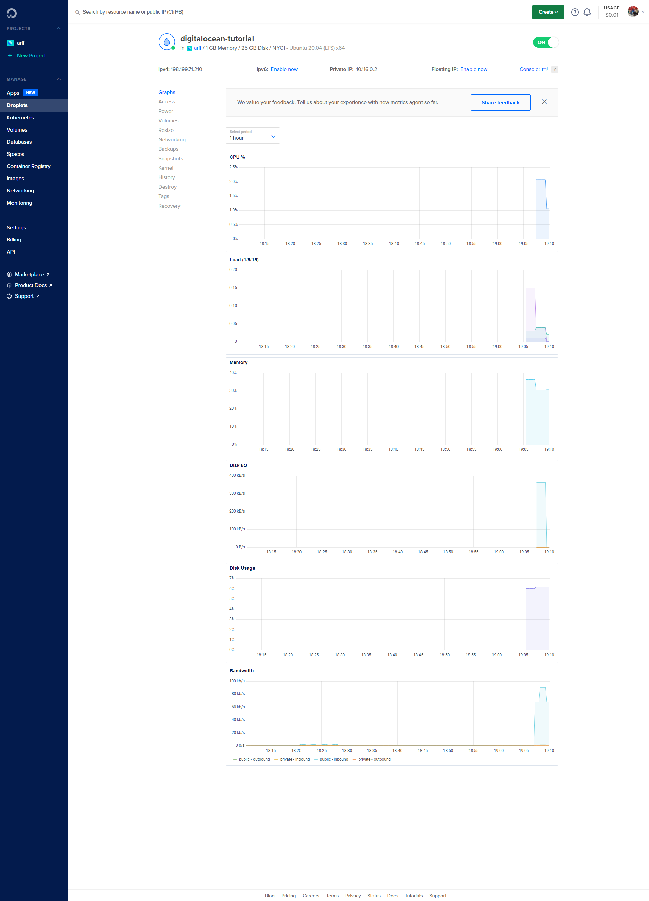

# Command

## Basic installation

- ssh to the droplet
  `ssh -i ~/.ssh/id_rsa root@XXX.XXX.XXX.XXX`
- update Ubuntu
  `apt-get update`
- install nginx
  `apt-get install nginx`
- check memory capacity
  `free -h`
- check storage capacity
  `df -h`

## Metrics

- installing metrics agent
  `curl -sSL https://repos.insights.digitalocean.com/install.sh | sudo bash`
- installing stree (a package to burn CPU)
  `apt-get install stress`
- installing htop (a package to view stat)
  `apt-get install htop`
- stress the CPU for 30 seconds
  `stress --cpu 1 --timeout 30`
- view stat
  `htop`

# Notes

## Digital Ocean Provide Infrastructer as a Service (IAAS)

1. https://cloud.digitalocean.com/
2. IAAS means a lot of thing we need to develop ourselves
3. Is a cloud hosting provider like aws, gcp (google cloud platform), azure
4. Provide hardware for us to host website on cloud
5. Not many feature provided by digital ocean compare from other cloud provider
6. straight forward billing cost
   6.1. The cheapest $5/month instance 1GB Ram 1 CPU, 25GB Harddiskand 1000GB Transfer - perfect for 1000 - 2000 visit per month. As comparison 1000GB data transfer on AWS will cost $70 to $100 per month.
   6.2. A lot cheaper from AWS

[note: Data Transfer means when somebody visit your website(computer/droplet), server from the computer has to sent them some data. Digital Ocean has to communicate to the client who visit the website via internet. This event involve cost in maintaining the whole internet infrastructure eg. the router, the gateway etc. So 1000GB data transfer means, Digital Ocean allows our droplet 1000GB free data transfer from our droplet to any computer (accumulative) per month. Excessive data transfer will be charge by Digital Ocean]

## Digital Ocean vs Heroku

1. Heroku is Platfrom as a Service(PaaS)
2. Heroku provide platform for you, not infrastucture, they manage the infrastructure. Price is higher.
3. Not as best approach for cloud enginner, we need to manage ourselves about eg. load balancer, server and everything.

## Digital Ocean vs GoDaddy

1. If we know about server, never go for GoDaddy or HostGator because this is completely managed solution.
2. As back-end development is not good.
3. Cost little bit higher than digital ocean.

# Get started with DigitalOcean

## Basic Idea behind the Website

1. Get a computer.
2. Get a public ip address for that computer that is connected to internet (every computer connected to internet has an ip address).
3. Get a domain (optional because we can directly use public ip address).
4. Setting the computer to response something when somebody visit.

## How Digital Ocean come into the picture

### Basic Idea of Droplet

1. Digital Ocean allows us to create a droplet.
   1.1. Droplet takes care of the first 2 things above which are give us a computer and connect it to the internet.
   1.2. When we create a droplet, digital ocean will launch a computer for us and only us, and will give us the ip address.
   1.3. Droplet is a computer sitting somewhere in this planet and has an associated ip address which can be used to reach out to that particular computer over the internet.

## Creating A Droplet

1. Choose an image
   1.1. Choosing an operating system to be running on that computer.
   1.2. Digital Ocean just ship with linux OS eq. Ubuntu, CentOS
2. Choose a plan
   2.1. Starter
   2.1.1. Standard - The CPU that being used, is also being used by some other person running the standard instance as well. For simple project, it work normally. Cheapest.
   2.2. Performance
   2.2.1. General Purpose - The CPU is completely yours. No other person using it. Cost also higher.
   2.2.2. CPU-Optimized
   2.2.3. Memory-Optimized

## Data Center

1. Where you want to host that computer.
2. The location of data center.
3. Try yourself to see which data center better.
4. Maybe New York or San Francisco is better.
5. You can also choose depending on which area your most client live.

## VPC Network

1. No VPC

## Select Additional Options

1. IPV6 - no need currently
2. User data - used to run bunch of things before droplet is handed over to you.
3. Monitoring - enable enhance graph, also can be configure after receive the droplet.

## Authentication

1. How to connect to the droplet
2. SSH key or Password
3. Always use SSH key (more secure)
4. Use git bash for window, for Mac terminal is ok

#### SSH

1. cd ~/.ssh/
2. ssh-keygen --> will generate 2 file which are publickey and private key, public key will be used by the server and will be stored in the server, private key will be used by you to authenticated to the server (like a password).

# Useful command

1. ssh -i <location of private key> root@<public ip address>
   1.1 usually command is ssh -i ~/.ssh/id_rsa root@195.024.054.054
2. after succesfully connecting to droplet
3. free -h ---> to access memory capacity
4. df -h ---> to view storage capacity
5. apt-get update ---> update ubuntu
6. apt-get install nginx ---> to install nginx server
7. service nginx status

# Metrics

1. In previous setting, we dont tick on monitoring (Select Additional Options), we will do it here.
2. Picture below shows graph default by digital ocean before install the metrics.
   
3. Link to refer to install metrics agent https://docs.digitalocean.com/products/monitoring/how-to/install-agent/
4. ssh to the root@XXX.XXX.XXX.XXX
5. curl -sSL https://repos.insights.digitalocean.com/install.sh | sudo bash
6. After installation result as picture below.
   
7. `apt-get install stress` (stress is a package to burn CPU cores)
8. `apt-get install htop` (tools to view stat)
9. `stress --cpu 1 --timeout 30` (stress the CPU for 30 seconds)
10. `htop` (this command to view stat)
